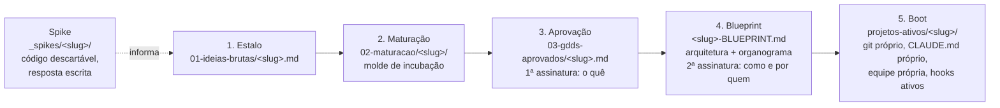

# Software Machine: uma fábrica de software conduzida por agentes

> Framework operacional para levar uma ideia de software ou de jogo do estalo ao repositório com Claude Code: papéis definidos, fases com artefatos verificáveis, biblioteca de arquétipos de agentes e enforcement de território por hooks. Nenhum código de produto nasce sem duas assinaturas.


## 🇺🇸 English summary

- A lightweight "software factory" for solo development with AI agents. The root folder holds a constitution (`CLAUDE.md`) that defines roles (the founder decides, an orchestrator agent plans, per-project agent teams build) and a mandatory pipeline: idea card, maturation, approved GDD/PRD, signed blueprint, boot.
- Each phase ends with a verifiable artifact, not a feeling of agreement. Spikes are the only sanctioned way to write throwaway code outside the pipeline, and they must end in a written answer.
- Projects are physically isolated: each one gets its own folder, git repository, `CLAUDE.md` and agent team. Write access per agent is enforced by hooks, not by trust.
- Ships reusable templates: incubation prompts for games and software, boot prompts that execute a blueprint, a territory-enforcement recipe and ten agent archetypes.
- First project born from this factory: [edital-quest](https://github.com/RicardoInoue95/edital-quest).

## O problema

- Desenvolver sozinho com agentes de IA é rápido demais para o próprio bem: protótipos viram produto sem escopo, decisões de arquitetura não ficam registradas e vários projetos se contaminam na mesma sessão.
- Faltava um método que impusesse ritmo (o que decidir antes de codar), memória (onde cada decisão fica escrita) e fronteiras (quem pode mexer em quê).

## A solução



- **Raiz é a fábrica:** só documentos e decisões, várias ideias em paralelo, nunca código.
- **Projeto é a oficina:** um projeto por sessão, com o próprio `CLAUDE.md`, e nunca outro projeto.
- A separação é física: cada pasta carrega o próprio contexto, então o agente aberto na oficina não enxerga a constituição da fábrica como regra de trabalho, e o agente aberto na raiz não enxerga código de projeto nenhum.

## Destaques técnicos

- **Fases com prova de conclusão.** Cada fase termina em um artefato verificável: ficha com slug e tipo, checklist de saída marcado, rodapé com data de aprovação, blueprint assinado, commit inicial. Fase sem artefato não aconteceu.
- **Duas assinaturas antes de qualquer código.** A primeira aprova o que será feito (GDD ou PRD); a segunda aprova como e por quem (árvore de pastas e organograma de agentes). Nenhum arquivo de projeto é gerado antes da segunda.
- **Vocabulário de comando.** Frases fixas do fundador disparam cada fase ("Nova ideia", "Vamos maturar", "Aprovo o GDD", "Blueprint de", "Boot"). Fora do vocabulário, o orquestrador pergunta em que fase está antes de agir.
- **Spike como válvula de honestidade.** Código exploratório é permitido em uma trilha própria, com contrato de descarte e saída escrita. Sem essa trilha, o primeiro teste rápido aconteceria fora da fábrica e o método viraria ficção.
- **Enforcement de território por hook, não por confiança.** O molde `enforcement-territorio.md` transforma a matriz "agente × pastas" do blueprint em permissões executáveis e em um hook PowerShell que bloqueia escrita fora do território. Fronteiras de contrato são bloqueadas inclusive para o dono.
- **Biblioteca de arquétipos.** Dez papéis prontos para adaptar (product owner, game designer, engine dev, frontend dev, backend dev, devops, QA, security reviewer, platform specialist, asset pipeline), cada um com território, entregas e gatilhos de bloqueio.
- **Moldes como prompts executáveis.** Incubação (ideia para GDD/PRD, entrevista bloco a bloco) e boot (executa o blueprint ao pé da letra) são documentos que o agente segue, com critérios de saída explícitos.
- **Lições registradas onde doem.** A constituição guarda armadilhas pagas, como a corrupção silenciosa de UTF-8 sem BOM ao transformar arquivos com PowerShell 5.1, com a receita segura ao lado.

## Estrutura do repositório

```
.
├── CLAUDE.md                        → a constituição: papéis, pipeline, isolamento, convenções
├── _planning/                       → a incubadora
│   ├── 01-ideias-brutas/            → uma ficha por ideia (_FICHA-TEMPLATE.md)
│   ├── 02-maturacao/                → ideias em lapidação, com checklist de saída
│   └── 03-gdds-aprovados/           → GDD/PRD assinados e blueprints (exemplo: edital-quest)
├── _spikes/                         → a bancada: regras e gabarito de SPIKE.md
└── _templates/                      → os moldes
    ├── incubacao-jogo.md · incubacao-software.md
    ├── boot-projeto-jogo.md · boot-projeto-software.md
    ├── enforcement-territorio.md    → matriz de território para permissões e hook
    └── agentes/                     → dez arquétipos + _ARQUETIPO-TEMPLATE.md
```

Os projetos gerados vivem em `projetos-ativos/<slug>/`, cada um com o próprio repositório git, e por isso não fazem parte deste repositório.

## Como usar

1. Clone o repositório e abra o Claude Code na raiz. O `CLAUDE.md` é lido como constituição.
2. Solte uma ideia: `Nova ideia: <descrição>`. O orquestrador cria a ficha em `_planning/01-ideias-brutas/` e propõe perguntas de maturação.
3. `Vamos maturar <slug>`: a ficha vai para `02-maturacao/<slug>/` e o molde de incubação conduz a entrevista até um GDD ou PRD candidato.
4. `Aprovo o GDD de <slug>` e depois `Blueprint de <slug>`: o orquestrador desenha árvore de pastas e organograma de agentes e submete.
5. `Aprovo o blueprint de <slug>` e `Boot <slug>`: o projeto nasce em `projetos-ativos/<slug>/` com git, `CLAUDE.md`, agentes e hooks. Feche a sessão da raiz e abra outra dentro do projeto.
6. Precisa responder uma dúvida técnica antes de decidir? `Spike: <pergunta>` cria `_spikes/<slug>/SPIKE.md` e libera código descartável.

## Status e roadmap

- Em uso. Um projeto completou o pipeline inteiro (edital-quest, jogo) e uma ideia está na incubadora.
- Próximos passos: registrar os spikes do primeiro projeto como exemplos, e amadurecer o molde de software com um segundo projeto de tipo diferente.

## Projeto relacionado

- [edital-quest](https://github.com/RicardoInoue95/edital-quest): RPG de estudo para concursos, primeiro projeto nascido desta fábrica. O GDD e o blueprint assinados estão em `_planning/03-gdds-aprovados/` como exemplo completo do pipeline.

## Licença

Conteúdo e templates sob licença [MIT](LICENSE).

## Autor

Ricardo Inoue · [GitHub](https://github.com/RicardoInoue95)
